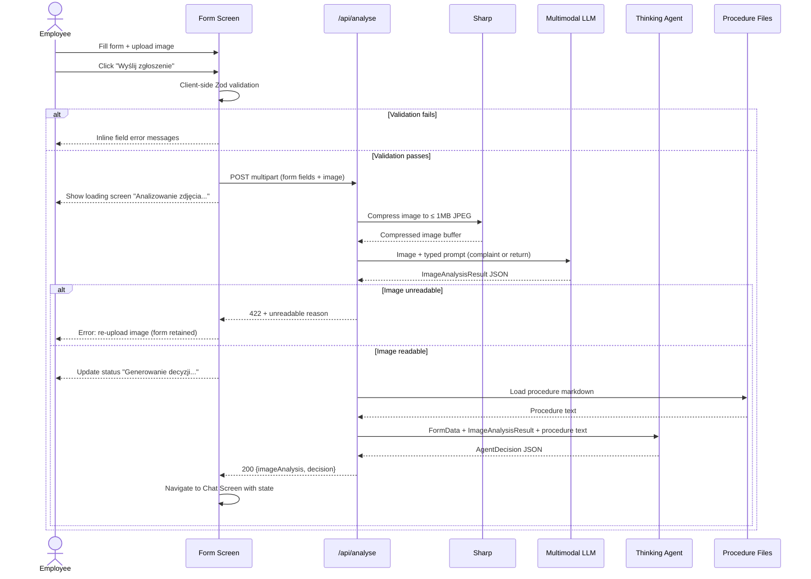
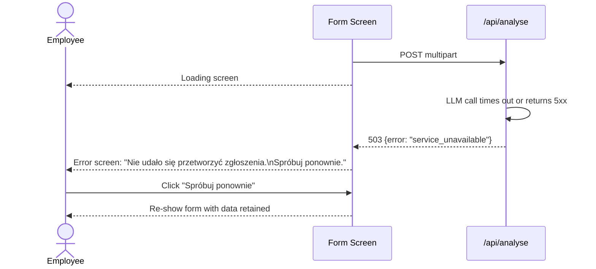

# ADR: Hardware Service Decision Copilot — Main Architecture

**Date:** 2026-06-24
**Status:** Accepted
**PRD:** `docs/PRD-Product-Requirements-Document.md`

---

## 1. Overview

This ADR defines the complete technical architecture for the Hardware Service Decision Copilot MVP — an internal web application that guides employees through a structured complaint/return form, analyses an uploaded equipment photo using a multimodal LLM, and delivers a rule-based decision via a streaming chat interface powered by a thinking LLM agent.

The PRD defines what the system must do and how it must behave. This ADR defines how it is built: stack, module boundaries, data contracts, environment setup, and testing strategy. Together they give an implementing agent a complete, unambiguous specification.

---

## 2. Context7 Library References

All libraries used in this project. Implementing agents must use these handles to fetch docs — do not search for them again.

| Library | Context7 Handle | Used for |
|---|---|---|
| Next.js | `/vercel/next.js` | Full-stack framework — App Router, API routes, server actions |
| Vercel AI SDK | `/vercel/ai` | LLM streaming, `streamText`, `generateText`, `useChat` hook |
| React | `/reactjs/react.dev` | Frontend UI components and state |
| Tailwind CSS | `/tailwindlabs/tailwindcss.com` | Utility-first CSS styling |
| shadcn/ui | `/shadcn-ui/ui` | Accessible UI component primitives |
| Zod | `/colinhacks/zod` | Runtime schema validation for API inputs and LLM outputs |
| Sharp | `/lovell/sharp` | Server-side image compression before LLM submission |
| Vitest | `/vitest-dev/vitest` | Unit and integration test runner |
| Playwright | `/microsoft/playwright` | End-to-end browser tests |

---

## 3. System Architecture

### Architecture Pattern

Single-repository Next.js application (monolith). Frontend (React, App Router) and backend (API Route Handlers) coexist in one Next.js project under `app/`. No separate backend service. No database in MVP.

### Repository Structure

```
app/
  (form)/
    page.tsx                  — Form screen (Screen 1)
  (chat)/
    page.tsx                  — Chat screen (Screen 3)
  api/
    analyse/
      route.ts                — POST: receives form + image, runs multimodal LLM + agent, returns decision
    chat/
      route.ts                — POST: streaming chat endpoint (Vercel AI SDK streamText)
  layout.tsx
  globals.css

components/
  form/
    ComplaintReturnForm.tsx   — Form component with all fields
    ImageUpload.tsx           — File upload with preview
  chat/
    ChatInterface.tsx         — Chat UI shell
    MessageBubble.tsx         — Single message rendering
    DecisionBadge.tsx         — Decision result badge (Zaakceptowano / Odrzucono / Wymaga weryfikacji)

lib/
  llm/
    multimodal.ts             — Multimodal LLM call (image analysis)
    agent.ts                  — Thinking agent call (decision generation)
    prompts.ts                — All prompt templates
  compression/
    image.ts                  — Sharp-based image compression
  validation/
    form.ts                   — Zod schemas for form input
    api.ts                    — Zod schemas for API request/response bodies
  procedures/
    loader.ts                 — Loads complaint/return procedure markdown files at startup

docs/
  procedures/
    complaint-procedure.md    — Injected into complaint agent prompt
    return-procedure.md       — Injected into return agent prompt

public/
  assets/                     — Static assets (logo, favicon)

.env.local                    — Local secrets (gitignored)
.env.example                  — Template for required env vars
```

### Technology Stack

| Layer | Technology | Reason |
|---|---|---|
| Frontend framework | Next.js 14+ (App Router) | Full-stack in one project; server components reduce client bundle; built-in API routes |
| UI components | shadcn/ui + Tailwind CSS | Accessible, unstyled primitives + utility CSS; no runtime CSS-in-JS |
| AI/LLM integration | Vercel AI SDK (`streamText`, `generateText`) | First-class Next.js integration; provider-agnostic; streaming chat via `useChat` |
| Multimodal LLM | Claude claude-sonnet-4-6 (claude-sonnet-4-6) via Anthropic | State-of-the-art vision + text; same provider as thinking agent; one API key |
| Thinking LLM | Claude claude-sonnet-4-6 with extended thinking via Anthropic | Extended reasoning for reliable rule-based decisions; same provider |
| Schema validation | Zod | TypeScript-first; used for API input validation and LLM output parsing |
| Image compression | Sharp (server-side, API route) | High-performance Node.js image processing; reduces image to ≤ 1 MB before LLM call |
| Session state | React state (`useState` / `useReducer`) in client components | No DB in MVP; form data and chat history live in browser memory for the session duration |
| Testing — unit/integration | Vitest | Fast, native ESM, compatible with Next.js and Vercel AI SDK mocking patterns |
| Testing — E2E | Playwright | Browser automation; tests the full user journey end-to-end |

---

## 4. Module Structure & Dependencies

```
components/form/         → depends on: lib/validation/form.ts
components/chat/         → depends on: Vercel AI SDK (useChat)
app/(form)/page.tsx      → depends on: components/form/, lib/validation/form.ts
app/(chat)/page.tsx      → depends on: components/chat/
app/api/analyse/route.ts → depends on: lib/compression/image.ts, lib/llm/multimodal.ts, lib/llm/agent.ts, lib/validation/api.ts, lib/procedures/loader.ts
app/api/chat/route.ts    → depends on: Vercel AI SDK (streamText), lib/llm/prompts.ts
lib/llm/multimodal.ts    → depends on: Vercel AI SDK (generateText), lib/llm/prompts.ts
lib/llm/agent.ts         → depends on: Vercel AI SDK (generateText), lib/llm/prompts.ts, lib/procedures/loader.ts
lib/llm/prompts.ts       → no internal dependencies (pure string templates)
lib/compression/image.ts → depends on: Sharp
lib/procedures/loader.ts → depends on: Node.js `fs` (reads markdown files at startup)
lib/validation/          → depends on: Zod only
```

Dependency direction is strictly inward: `app/` → `components/` → `lib/` → external packages. No circular dependencies. `lib/` modules never import from `app/` or `components/`.

---

## 5. Data Models

### FormSubmission
Represents the validated data collected from the form before submission.

| Field | Type | Notes |
|---|---|---|
| `requestType` | `"reklamacja" \| "zwrot"` | Determines which LLM prompts and procedure doc to use |
| `equipmentCategory` | `string` (enum of 8 values) | Predefined category list from PRD Section 8 |
| `equipmentModel` | `string` | Max 200 chars, free text |
| `purchaseDate` | `Date` | Must not be in the future |
| `complaintReason` | `string \| undefined` | Required when `requestType === "reklamacja"`, max 2000 chars |
| `imageFile` | `File` | Validated: JPG/PNG/WebP, max 10 MB |

### ImageAnalysisResult
Returned by the multimodal LLM after analysing the uploaded photo.

| Field | Type | Notes |
|---|---|---|
| `status` | `"ok" \| "unreadable"` | `"unreadable"` triggers the re-upload error flow |
| `conditionSummary` | `string` | Human-readable description of visible condition |
| `damagePresent` | `boolean` | Whether damage is visible |
| `damageType` | `string \| null` | Type/location of damage if present |
| `likelyCause` | `"manufacturing_defect" \| "user_damage" \| "wear_and_tear" \| "unknown" \| null` | Complaint scenario only |
| `signsOfUse` | `boolean \| null` | Return scenario only |
| `resalable` | `boolean \| null` | Return scenario only |
| `unreadableReason` | `string \| null` | Populated when `status === "unreadable"` |

### AgentDecision
Returned by the thinking agent after evaluating the case against procedure rules.

| Field | Type | Notes |
|---|---|---|
| `decision` | `"zaakceptowano" \| "odrzucono" \| "wymaga_weryfikacji"` | The decision result |
| `justification` | `string` | Narrative explanation referencing specific rules |
| `rulesApplied` | `string[]` | Array of rule IDs cited (e.g. `["RULE-C-05", "RULE-C-13"]`) |
| `nextSteps` | `string[]` | Numbered list of recommended employee actions |
| `disclaimer` | `string` | Static AI-generated decision disclaimer text (Polish) |

### ChatSession
Held in React state on the client for the duration of the browser session.

| Field | Type | Notes |
|---|---|---|
| `formData` | `FormSubmission` | Original form values, included in system prompt |
| `imageAnalysis` | `ImageAnalysisResult` | Included in system prompt |
| `initialDecision` | `AgentDecision` | Displayed as first chat message |
| `messages` | `Message[]` | Vercel AI SDK `useChat` message array |

---

## 6. API / Interface Contracts

See `docs/ADR/001-backend-api.md` for detailed endpoint specifications.

**Summary of endpoints:**

| Method | Path | Purpose |
|---|---|---|
| `POST` | `/api/analyse` | Receives multipart form data (form fields + image), compresses image, runs multimodal LLM analysis, runs thinking agent, returns `AgentDecision` + `ImageAnalysisResult` |
| `POST` | `/api/chat` | Vercel AI SDK streaming chat endpoint; receives messages array + system context, streams agent response |

---

## 7. Environment Variables

| Variable | Purpose | Required | Example value |
|---|---|---|---|
| `ANTHROPIC_API_KEY` | Anthropic API key for Claude models | Yes | `sk-ant-...` |
| `NEXT_PUBLIC_APP_TITLE` | Application title shown in UI | No | `Hardware Service Decision Copilot` |

No database connection strings, no auth secrets — MVP has no persistence and no authentication.

---

## 8. Technical Decisions

### Next.js full-stack monolith (no separate backend service)
**Status:** Accepted
**Date:** 2026-06-24
**Context:** The PRD describes a simple two-screen SPA with two AI-powered backend operations. No database, no auth, no microservice communication is needed in MVP.
**Decision:** Use Next.js App Router as both the frontend framework and the backend API host. API route handlers in `app/api/` handle image processing and LLM calls server-side.
**Rejected alternatives:**
- Separate Express/Fastify backend: Adds deployment complexity and a second process for no benefit at MVP scale.
- Java/Spring Boot backend: The course primary demo stack is TypeScript. Java remains a participant option but the demo uses Next.js.
**Consequences:**
- (+) One repository, one deployment, one `npm run dev` to start everything.
- (-) API routes share the Next.js runtime; CPU-heavy image compression (Sharp) blocks the event loop unless offloaded — mitigated by Sharp's native async API.
**Review trigger:** If the backend needs to scale independently from the frontend, or if Java is chosen as the course implementation language.

### Claude claude-sonnet-4-6 for both multimodal analysis and thinking agent
**Status:** Accepted
**Date:** 2026-06-24
**Context:** The system requires two distinct LLM roles: a vision-capable model for image analysis and a reasoning-capable model for rule-based decision making.
**Decision:** Use `claude-sonnet-4-6` for the multimodal image analysis call (vision + text) and `claude-sonnet-4-6` with extended thinking enabled for the decision agent. Single Anthropic API key, single provider, consistent latency profile.
**Rejected alternatives:**
- GPT-4o (multimodal) + o1 (reasoning): Would require an OpenAI API key in addition to or instead of Anthropic; splits provider configuration.
- OpenRouter as a proxy: Adds an intermediary with its own latency and failure modes; not needed for MVP with a single provider.
**Consequences:**
- (+) One API key, one SDK configuration, predictable pricing.
- (-) Vendor lock-in to Anthropic; switching models requires changes to `lib/llm/` only.
**Review trigger:** If Anthropic API availability or pricing becomes a constraint, or if a different model shows materially better decision quality on the procedure rules.

### React client state for session management (no server-side session)
**Status:** Accepted
**Date:** 2026-06-24
**Context:** The PRD explicitly defers session persistence to a later phase. Chat history and form data only need to survive within a single browser tab session.
**Decision:** Store `FormSubmission`, `ImageAnalysisResult`, `AgentDecision`, and chat messages in React component state (`useState`). Pass form context to the chat API via the `useChat` system prompt mechanism on each request.
**Rejected alternatives:**
- Server-side session (Redis/in-memory): Adds infrastructure complexity with no PRD requirement.
- localStorage: Would survive page refresh, but cross-tab isolation and stale state are harder to manage; not needed for MVP.
**Consequences:**
- (+) Zero infrastructure beyond Next.js; trivially simple.
- (-) Session lost on page refresh — explicitly acceptable per PRD out-of-scope definition.
**Review trigger:** When session persistence is added (PRD optional feature).

### Streaming chat responses via Vercel AI SDK `streamText`
**Status:** Accepted
**Date:** 2026-06-24
**Context:** The thinking agent with extended reasoning can take 10–30 seconds to produce a full response. Streaming allows the UI to show tokens as they arrive rather than blocking the user.
**Decision:** Use Vercel AI SDK `streamText` in `app/api/chat/route.ts` and the `useChat` hook in the frontend `ChatInterface` component. The initial decision (from `/api/analyse`) is NOT streamed — it is a single blocking call that returns a complete `AgentDecision` JSON before the chat screen opens.
**Rejected alternatives:**
- Non-streaming (full response wait): Unacceptable UX for a model with extended thinking; user would see a blank screen for 10–30 seconds.
- Server-Sent Events manually: Vercel AI SDK already implements this pattern; reimplementing it adds complexity.
**Consequences:**
- (+) Progressive rendering; better perceived performance.
- (-) `/api/analyse` (first call) is still blocking — loading screen with status messages mitigates this per PRD Screen 2 spec.
**Review trigger:** If the initial `/api/analyse` call exceeds 30 seconds consistently; consider streaming that call too.

### Sharp for server-side image compression
**Status:** Accepted
**Date:** 2026-06-24
**Context:** The PRD requires backend compression to ≤ 1 MB before sending to the multimodal LLM. Client-side compression was considered.
**Decision:** Compress images server-side in `app/api/analyse/route.ts` using Sharp. Target output: JPEG, quality 80, max 1 MB. Original file is not stored.
**Rejected alternatives:**
- Client-side compression (`browser-image-compression`): Reduces upload size but adds frontend JS bundle weight and makes server-side validation of the compressed result harder.
- No compression: Claude's vision API accepts larger images, but enforcing a consistent size limit server-side keeps costs predictable.
**Consequences:**
- (+) Server controls quality and size; client sends original file without preprocessing.
- (-) Sharp requires native binaries; must be available in the deployment environment.
**Review trigger:** If deploying to an environment where Sharp native binaries are unavailable (e.g. some edge runtimes) — switch to client-side compression in that case.

---

## 9. Diagrams

### 9.1 Architecture / Component Diagram

```mermaid
graph TD
    subgraph Browser
        F[Form Screen\nComplaintReturnForm\nImageUpload]
        C[Chat Screen\nChatInterface\nuseChat hook]
    end

    subgraph Next.js Server
        AR[/api/analyse\nRoute Handler]
        CR[/api/chat\nRoute Handler]
        IMG[lib/compression/image.ts\nSharp]
        MM[lib/llm/multimodal.ts\nImage Analysis]
        AG[lib/llm/agent.ts\nDecision Agent]
        PR[lib/procedures/loader.ts\nProcedure Docs]
        PROM[lib/llm/prompts.ts\nPrompt Templates]
    end

    subgraph Anthropic API
        CL1[claude-sonnet-4-6\nVision]
        CL2[claude-sonnet-4-6 + Extended Thinking\nReasoning]
    end

    subgraph Filesystem
        CPD[docs/procedures/\ncomplaint-procedure.md\nreturn-procedure.md]
    end

    F -->|multipart POST| AR
    AR --> IMG
    IMG --> MM
    AR --> PR
    PR --> CPD
    MM --> CL1
    MM -->|ImageAnalysisResult| AG
    AR --> AG
    AG --> PR
    AG --> PROM
    AG --> CL2
    AG -->|AgentDecision| AR
    AR -->|JSON response| F
    F -->|navigate + pass state| C
    C -->|streaming POST| CR
    CR --> PROM
    CR --> CL2
    CR -->|stream| C
```

### 9.2 Data Flow Diagram

```mermaid
flowchart LR
    U([Employee Browser]) -->|1. FormSubmission + image file| A[POST /api/analyse]
    A -->|2. image buffer| S[Sharp compress\n→ JPEG ≤1MB]
    S -->|3. base64 image + complaint prompt| M[Multimodal LLM\nclaude-sonnet-4-6]
    M -->|4. ImageAnalysisResult JSON| AG[Thinking Agent\nclaude-sonnet-4-6 + thinking]
    A -->|5. FormSubmission + procedure doc| AG
    AG -->|6. AgentDecision JSON| A
    A -->|7. {imageAnalysis, decision}| U
    U -->|8. user message + system context| C[POST /api/chat]
    C -->|9. streamed tokens| U
```

### 9.3 Sequence Diagrams

#### Form Submission and Initial Decision (Happy Path)



#### Chat Interaction (Streaming)

```mermaid
sequenceDiagram
    actor E as Employee
    participant C as Chat Screen
    participant API as /api/chat
    participant Agent as Thinking Agent

    C->>C: Mount with {formData, imageAnalysis, initialDecision}
    C-->>E: Display first message (decision bubble)
    E->>C: Type message + click Send
    C->>API: POST {messages[], systemPrompt with context}
    API->>Agent: streamText with full context
    Agent-->>API: Token stream
    API-->>C: SSE stream (Vercel AI SDK protocol)
    C-->>E: Tokens rendered progressively in chat bubble
    Agent-->>API: Stream complete
    API-->>C: [DONE]
    C-->>E: Final message displayed; input re-enabled
```

#### Error Path — LLM Timeout or API Failure



---

## 10. Testing Strategy

See `docs/ADR/003-ai-agents.md` for AI-specific test scenarios.

### Philosophy

TDD is the primary self-validation mechanism. Write tests before implementing each module. The separation between `lib/` (pure logic) and `app/` (Next.js routing) makes `lib/` fully testable without Next.js infrastructure.

### Test Layers

| Layer | Type | Scope | Tools |
|---|---|---|---|
| Unit | Pure functions | `lib/validation/`, `lib/compression/`, `lib/procedures/`, `lib/llm/prompts.ts` | Vitest |
| Integration | API routes with mocked LLM | `app/api/analyse`, `app/api/chat` | Vitest + `@ai-sdk/anthropic` mock |
| Component | UI components | Form validation feedback, chat message rendering | Vitest + React Testing Library |
| E2E | Full user journey | Form → Processing → Chat, all error paths | Playwright |

### Key Test Scenarios

| Scenario | Type | Input | Expected output |
|---|---|---|---|
| Form validation — missing image | Unit | `FormSubmission` without `imageFile` | Zod parse error on `imageFile` field |
| Form validation — future purchase date | Unit | `purchaseDate` = tomorrow | Zod parse error on `purchaseDate` |
| Form validation — complaint without reason | Unit | `requestType: "reklamacja"`, `complaintReason: undefined` | Zod parse error on `complaintReason` |
| Image compression — large JPEG | Unit | 8 MB JPEG buffer | Output buffer ≤ 1 MB, MIME type `image/jpeg` |
| Image compression — oversized WebP | Unit | 10 MB WebP buffer | Output buffer ≤ 1 MB |
| Procedure loader — complaint | Unit | Filesystem mock with complaint-procedure.md | Returns full markdown string |
| `/api/analyse` — happy path complaint | Integration | Valid multipart + mock LLM returning valid JSON | 200 with `AgentDecision` and `decision: "zaakceptowano"` |
| `/api/analyse` — unreadable image | Integration | Valid multipart + mock LLM returning `status: "unreadable"` | 422 with `unreadableReason` |
| `/api/analyse` — LLM timeout | Integration | Valid multipart + mock LLM throwing timeout error | 503 with `error: "service_unavailable"` |
| `/api/chat` — streaming response | Integration | Valid messages array + mocked `streamText` | SSE stream with at least one chunk |
| E2E — full complaint flow | E2E | Fill form, upload test JPEG, submit | Chat screen opens with decision bubble containing "Zaakceptowano" or "Odrzucono" |
| E2E — image re-upload flow | E2E | Upload a non-equipment image (mocked unreadable response) | Error message on loading screen, form shown with image field highlighted |
| E2E — off-topic chat message | E2E | Send "Jaka jest cena tego produktu?" in chat | Agent response does not answer the question; redirects to the case |

### Technical Acceptance Criteria

- **TAC-01**: `POST /api/analyse` returns HTTP 200 with a valid `AgentDecision` JSON body within 60 seconds for a valid 5 MB JPEG input.
- **TAC-02**: `POST /api/analyse` returns HTTP 422 when the multimodal LLM returns `status: "unreadable"`.
- **TAC-03**: `POST /api/analyse` returns HTTP 503 when the Anthropic API call throws a network error.
- **TAC-04**: `POST /api/chat` returns a streaming response (Content-Type: `text/event-stream`) within 3 seconds of receiving a valid request.
- **TAC-05**: The compressed image output from `lib/compression/image.ts` is always ≤ 1,048,576 bytes (1 MB) regardless of input size (up to 10 MB).
- **TAC-06**: Form submission with a file > 10 MB is rejected client-side before any network request is made.
- **TAC-07**: All `lib/` modules have ≥ 80% statement coverage measured by Vitest.
- **TAC-08**: The Playwright E2E suite passes against a locally running `next dev` instance with mocked Anthropic API responses.
