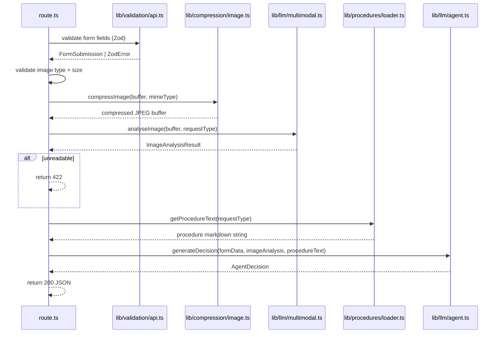

# ADR-001: Backend API

**Date:** 2026-06-24
**Status:** Accepted
**Relates to:** `docs/ADR/000-main-architecture.md`

---

## 1. Scope

This ADR covers the two Next.js API Route Handlers that form the backend of the application:

- `POST /api/analyse` — receives form submission + image, compresses image, calls multimodal LLM, calls thinking agent, returns decision
- `POST /api/chat` — streaming chat endpoint powered by Vercel AI SDK

It also covers image compression (`lib/compression/image.ts`) and procedure document loading (`lib/procedures/loader.ts`).

This ADR does NOT cover: frontend components, LLM prompt templates (see ADR-003), or test E2E setup (covered in ADR-000 testing section).

---

## 2. Context7 References

| Library | Context7 Handle | Used for |
|---|---|---|
| Next.js | `/vercel/next.js` | Route Handlers, `NextRequest`, `NextResponse` |
| Vercel AI SDK | `/vercel/ai` | `streamText`, `toDataStreamResponse` in chat route |
| Zod | `/colinhacks/zod` | API request and response body validation |
| Sharp | `/lovell/sharp` | Image compression in `lib/compression/image.ts` |

---

## 3. Component Design

### `app/api/analyse/route.ts`

Single exported `POST` handler. Responsibilities (in order):

1. Parse `multipart/form-data` from `NextRequest`.
2. Validate form fields using Zod schema (`lib/validation/api.ts` — `AnalyseRequestSchema`).
3. Validate image file: type (JPG/PNG/WebP), size (≤ 10 MB). Return 400 on failure.
4. Pass image buffer to `lib/compression/image.ts` → compressed buffer.
5. Determine request type (`reklamacja` or `zwrot`).
6. Call `lib/llm/multimodal.ts` with compressed image + typed prompt.
7. If `ImageAnalysisResult.status === "unreadable"` → return 422 with reason.
8. Load procedure document via `lib/procedures/loader.ts`.
9. Call `lib/llm/agent.ts` with form data + image analysis + procedure text.
10. Return 200 JSON: `{ imageAnalysis: ImageAnalysisResult, decision: AgentDecision }`.

Error handling:
- Zod parse failure → 400 `{ error: "validation_error", details: ZodError.issues }`
- Image type/size failure → 400 `{ error: "invalid_image", reason: string }`
- Unreadable image → 422 `{ error: "unreadable_image", reason: string }`
- LLM API error / timeout → 503 `{ error: "service_unavailable" }`
- Unexpected error → 500 `{ error: "internal_error" }`

### `app/api/chat/route.ts`

Single exported `POST` handler using Vercel AI SDK streaming pattern. Responsibilities:

1. Parse JSON body: `{ messages: Message[], context: ChatContext }`.
2. Validate with Zod (`ChatRequestSchema`).
3. Build system prompt from `context` (form data + image analysis + decision + procedure reference). Uses `lib/llm/prompts.ts`.
4. Call `streamText` with Claude model, system prompt, and messages array.
5. Return `result.toDataStreamResponse()` — Vercel AI SDK streaming protocol.

Error handling:
- Zod parse failure → 400
- LLM error during stream → stream terminates with error event; client `useChat` handles it

### `lib/compression/image.ts`

Pure async function: `compressImage(buffer: Buffer, mimeType: string): Promise<Buffer>`

Logic:
- Accept buffer and source MIME type.
- Use Sharp to resize to max 1920px on longest dimension (maintain aspect ratio).
- Convert to JPEG, quality 80.
- If output > 1 MB, reduce quality in steps of 10 until ≤ 1 MB or quality reaches 40.
- Return final JPEG buffer.
- Throws `ImageCompressionError` if unable to compress to ≤ 1 MB at quality 40.

### `lib/procedures/loader.ts`

Loads procedure markdown files from `docs/procedures/` at module initialisation (Node.js `fs.readFileSync`). Exports:

```
getProcedureText(requestType: "reklamacja" | "zwrot"): string
```

Files are read once at startup. No dynamic reloading in MVP. Throws on missing file so the error surfaces at startup, not at request time.

### `lib/validation/api.ts`

Zod schemas for API layer:

- `AnalyseRequestSchema` — validates parsed multipart fields (requestType, equipmentCategory, equipmentModel, purchaseDate string, optional complaintReason).
- `ImageAnalysisResultSchema` — validates LLM-returned image analysis JSON.
- `AgentDecisionSchema` — validates LLM-returned agent decision JSON.
- `ChatRequestSchema` — validates chat POST body (messages array + ChatContext).

---

## 4. Data Structures

### AnalyseRequest (multipart form fields)

| Field | Type | Validation |
|---|---|---|
| `requestType` | `string` | Must be `"reklamacja"` or `"zwrot"` |
| `equipmentCategory` | `string` | Must be one of the 8 predefined values |
| `equipmentModel` | `string` | Non-empty, max 200 chars |
| `purchaseDate` | `string` (ISO date) | Parseable date, not in the future |
| `complaintReason` | `string \| undefined` | Required if `requestType === "reklamacja"`, max 2000 chars |
| `image` | `File` (multipart) | JPG/PNG/WebP, max 10 MB |

### AnalyseResponse (200)

| Field | Type |
|---|---|
| `imageAnalysis` | `ImageAnalysisResult` (see ADR-000 Data Models) |
| `decision` | `AgentDecision` (see ADR-000 Data Models) |

### ChatContext (sent with every chat request)

| Field | Type | Notes |
|---|---|---|
| `requestType` | `"reklamacja" \| "zwrot"` | |
| `equipmentCategory` | `string` | |
| `equipmentModel` | `string` | |
| `purchaseDate` | `string` | ISO date string |
| `complaintReason` | `string \| undefined` | |
| `imageConditionSummary` | `string` | From `ImageAnalysisResult.conditionSummary` |
| `decisionResult` | `string` | From `AgentDecision.decision` |
| `decisionJustification` | `string` | From `AgentDecision.justification` |
| `rulesApplied` | `string[]` | From `AgentDecision.rulesApplied` |

---

## 5. Interface Contracts

### POST /api/analyse

**Request:**
- Content-Type: `multipart/form-data`
- Body: form fields (see AnalyseRequest) + `image` file field

**Response 200:**
```
Content-Type: application/json
Body: { imageAnalysis: ImageAnalysisResult, decision: AgentDecision }
```

**Response 400:**
```
Content-Type: application/json
Body: { error: "validation_error" | "invalid_image", details?: ZodIssue[], reason?: string }
```

**Response 422:**
```
Content-Type: application/json
Body: { error: "unreadable_image", reason: string }
```

**Response 503:**
```
Content-Type: application/json
Body: { error: "service_unavailable" }
```

**Notes:** No auth header required (MVP, internal network). Max request body size must be set to at least 11 MB in Next.js config (`api.bodyParser` is disabled for multipart; use `formidable` or native Web API `request.formData()`).

### POST /api/chat

**Request:**
- Content-Type: `application/json`
- Body: `{ messages: Message[], context: ChatContext }`

**Response 200:**
- Content-Type: `text/event-stream`
- Body: Vercel AI SDK data stream protocol (SSE)

**Response 400:**
```
Content-Type: application/json
Body: { error: "validation_error" }
```

**Notes:** Uses Vercel AI SDK `toDataStreamResponse()`. Client uses `useChat` hook which handles reconnection and message accumulation automatically.

---

## 6. Technical Decisions

### Multipart parsing with native Web API `request.formData()`
**Status:** Accepted
**Date:** 2026-06-24
**Context:** Next.js App Router Route Handlers receive a `NextRequest` (Web API `Request`). Parsing multipart/form-data can use the native `request.formData()` or a library like `formidable`.
**Decision:** Use native `request.formData()`. It returns a `FormData` object; files are `File` instances with `.arrayBuffer()` for buffer extraction. No additional dependency needed.
**Rejected alternatives:**
- `formidable`: Works in Node.js but requires accessing the underlying `req` object which is not directly exposed in App Router route handlers.
- `busboy`: Similar friction with App Router.
**Consequences:**
- (+) Zero extra dependencies; works natively with Next.js App Router.
- (-) `FormData` file size limit defaults may need overriding via `next.config.js` `experimental.serverActions.bodySizeLimit`.
**Review trigger:** If file upload exceeds 10 MB and Next.js rejects before the route handler validates it.

### Procedure files loaded synchronously at module initialisation
**Status:** Accepted
**Date:** 2026-06-24
**Context:** Procedure markdown files are static and change only when updated by an admin. They need to be available on every request.
**Decision:** Use `fs.readFileSync` at module load time in `lib/procedures/loader.ts`. The text is cached in a module-level variable. No async file I/O per request.
**Rejected alternatives:**
- Async `fs.readFile` per request: Unnecessary I/O on every API call for static content.
- Embedding files as TypeScript string constants: Makes updating procedures require a code deployment.
**Consequences:**
- (+) Zero per-request I/O; procedure text is always in memory.
- (-) App crashes at startup if procedure files are missing — this is intentional (fail-fast).
**Review trigger:** When procedure documents need to be editable without redeployment (add a CMS or database-backed loader).

---

## 7. Diagrams

### Component Interaction — /api/analyse



---

## 8. Testing Strategy

### Test scenarios for this area

| Scenario | Type | Input | Expected output | Edge cases |
|---|---|---|---|---|
| Valid complaint submission | Integration | Valid multipart, mocked LLM returns accepted decision | 200 with `AgentDecision` | — |
| Valid return submission | Integration | Valid multipart, mocked LLM returns rejected decision | 200 with `AgentDecision` | — |
| Missing complaint reason | Integration | `requestType: "reklamacja"`, no `complaintReason` | 400 validation error | — |
| Future purchase date | Integration | `purchaseDate` = tomorrow | 400 validation error | — |
| Image too large | Integration | 11 MB file | 400 invalid image | Exactly 10 MB should pass |
| Invalid image type | Integration | PDF file | 400 invalid image | — |
| Unreadable image | Integration | Mocked multimodal returning `status: "unreadable"` | 422 unreadable_image | — |
| LLM timeout | Integration | Mocked LLM throwing `AbortError` | 503 service_unavailable | — |
| Image compression 8MB → ≤1MB | Unit | 8 MB JPEG buffer | Output ≤ 1,048,576 bytes, JPEG format | Input exactly 10 MB |
| Procedure loader — missing file | Unit | Non-existent file path | Throws at module load | — |
| Chat route — valid stream | Integration | Valid messages + context, mocked `streamText` | SSE stream started, 200 | — |

### Technical acceptance criteria

- **TAC-001-01**: `compressImage` output is always ≤ 1,048,576 bytes for any input ≤ 10,485,760 bytes.
- **TAC-001-02**: `POST /api/analyse` returns 400 within 200ms for any Zod validation failure (no LLM call made).
- **TAC-001-03**: `POST /api/analyse` returns 503 when the Anthropic API call throws, within the configured timeout + 500ms.
- **TAC-001-04**: `POST /api/chat` sets `Content-Type: text/event-stream` and begins emitting chunks within 5 seconds.
- **TAC-001-05**: `getProcedureText("reklamacja")` and `getProcedureText("zwrot")` return non-empty strings in all test environments.
