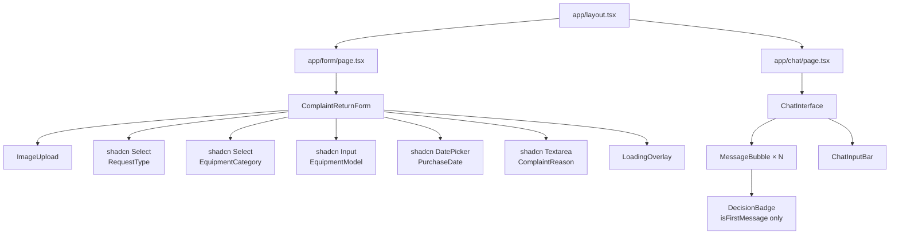
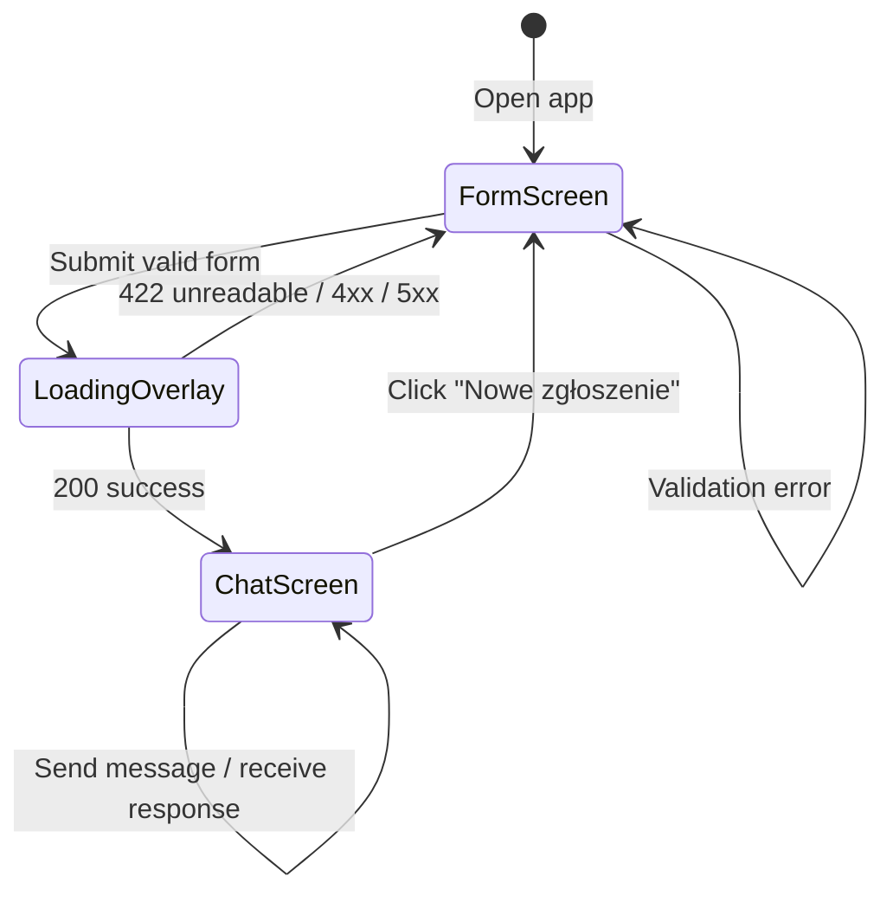

# ADR-002: Frontend

**Date:** 2026-06-24
**Status:** Accepted
**Relates to:** `docs/ADR/000-main-architecture.md`

---

## 1. Scope

This ADR covers everything the user sees and interacts with:

- Screen 1: Form (`app/(form)/page.tsx` and `components/form/`)
- Screen 2: Processing/loading state (inline within the form page)
- Screen 3: Chat interface (`app/(chat)/page.tsx` and `components/chat/`)
- Client-side validation, state management, navigation between screens
- UI component choices and styling conventions

This ADR does NOT cover: API route logic (ADR-001), prompt templates or AI behaviour (ADR-003).

---

## 2. Context7 References

| Library | Context7 Handle | Used for |
|---|---|---|
| Next.js | `/vercel/next.js` | App Router, client components, `useRouter` |
| React | `/reactjs/react.dev` | Component state, hooks |
| Vercel AI SDK | `/vercel/ai` | `useChat` hook in `ChatInterface` |
| Tailwind CSS | `/tailwindlabs/tailwindcss.com` | All styling |
| shadcn/ui | `/shadcn-ui/ui` | Button, Select, Input, Textarea, Badge, Card components |
| Zod | `/colinhacks/zod` | Client-side form validation (same schemas as server) |

---

## 3. Component Design

### App Router Structure

Two route groups avoid a shared layout between the form and chat screens:

- `app/(form)/page.tsx` — renders `<ComplaintReturnForm />`. Server component shell; form itself is a client component.
- `app/(chat)/page.tsx` — renders `<ChatInterface />`. Client component. Reads initial state from `sessionStorage` (written by form page after successful `/api/analyse` response).

Navigation from form to chat uses `router.push("/chat")` after writing session data to `sessionStorage`. The chat page reads this data on mount.

### `components/form/ComplaintReturnForm.tsx`

Client component (`"use client"`). Manages all form state with `useState`. Responsibilities:

- Renders all form fields (see PRD Section 9, Screen 1).
- Tracks `requestType` selection to conditionally make `complaintReason` required and update its label.
- On submit: runs Zod validation (`lib/validation/form.ts`) client-side, highlights errors.
- If valid: sets `submitting: true` (disables submit button, shows spinner), POSTs to `/api/analyse`.
- Shows loading status messages ("Analizowanie zdjęcia…", "Generowanie decyzji…") in a loading overlay while awaiting response.
- On 422 (unreadable image): shows error message on the image upload field, re-enables form.
- On 503/500: shows full-page error with "Spróbuj ponownie" button.
- On 200: writes `{ imageAnalysis, decision, formData }` to `sessionStorage`, navigates to `/chat`.

### `components/form/ImageUpload.tsx`

Client component. Responsibilities:

- Renders a file input styled as a drag-and-drop area.
- Accepts JPG, PNG, WebP only (`accept` attribute).
- On file selection: validates size (≤ 10 MB) immediately, shows inline error if too large.
- Displays filename + image thumbnail preview after valid file selected.
- Exposes `onChange(file: File | null)` callback to parent form.

### `components/chat/ChatInterface.tsx`

Client component. Responsibilities:

- On mount: reads `sessionStorage` for `{ imageAnalysis, decision, formData }`. If missing (direct navigation), redirects to `/`.
- Builds the `ChatContext` object from stored data.
- Uses `useChat` hook from Vercel AI SDK pointed at `POST /api/chat`. Passes `body: { context: chatContext }` on each request.
- Initialises `messages` with the first message (decision bubble) constructed from `AgentDecision` before `useChat` takes over. This message is prepended to the `useChat` messages array — it is display-only and not sent to the API.
- Renders message list with `<MessageBubble />` per message.
- Renders fixed chat input bar at the bottom with send button.
- Disables input while `useChat.isLoading === true`.
- Shows typing indicator while loading.
- Renders "Nowe zgłoszenie" button in header that clears `sessionStorage` and navigates to `/`.

### `components/chat/MessageBubble.tsx`

Pure presentational component. Props: `role: "user" | "assistant"`, `content: string`, `isFirstMessage?: boolean`.

- `role === "user"`: right-aligned bubble, neutral background.
- `role === "assistant"`: left-aligned bubble, slightly distinct background.
- `isFirstMessage === true`: renders structured decision layout with `<DecisionBadge />`, justification block, next steps list, and disclaimer in small text.
- All other assistant messages: render `content` as plain text (no structured sections).

### `components/chat/DecisionBadge.tsx`

Presentational component. Props: `decision: "zaakceptowano" | "odrzucono" | "wymaga_weryfikacji"`.

Renders a colour-coded badge:
- `zaakceptowano` → green
- `odrzucono` → red
- `wymaga_weryfikacji` → amber

---

## 4. Data Structures

### SessionStorage payload (key: `copilot_session`)

Written by form page, read by chat page. Cleared when "Nowe zgłoszenie" is clicked.

| Field | Type |
|---|---|
| `formData` | `FormSubmission` (serialised, dates as ISO strings) |
| `imageAnalysis` | `ImageAnalysisResult` |
| `decision` | `AgentDecision` |

### First chat message (constructed client-side, not from API)

The first visible message in the chat is constructed from `AgentDecision` in the component — it is never fetched from the API. It has `role: "assistant"` and is rendered with `isFirstMessage: true`. Its `content` is structured as:

```
{greeting}

**Decyzja:** {decision}

**Uzasadnienie:** {justification}

**Kolejne kroki:**
1. {nextSteps[0]}
2. {nextSteps[1]}
...

{disclaimer}
```

The `useChat` messages array starts empty; the first message is prepended visually only. The chat API receives the `AgentDecision` data via `ChatContext` in the request body, not as a message in the array.

---

## 5. Interface Contracts

### Form → /api/analyse

Request: `multipart/form-data` (see ADR-001).
On 200: navigate to `/chat`, pass data via `sessionStorage`.
On 422: show image field error, retain form.
On 4xx/5xx: show error screen with retry.

### Chat → /api/chat

Uses Vercel AI SDK `useChat` hook. The hook manages the POST body automatically. Additional `body` property `{ context: ChatContext }` is merged into each request.

### sessionStorage key: `copilot_session`

Read on `/chat` mount. If absent, redirect to `/`. Cleared on "Nowe zgłoszenie" click or when the user starts a new session.

---

## 6. Technical Decisions

### sessionStorage for cross-page state (no URL params, no global store)
**Status:** Accepted
**Date:** 2026-06-24
**Context:** The form page needs to pass `ImageAnalysisResult` and `AgentDecision` (potentially large JSON) to the chat page after a client-side navigation. Options: URL query params, global state store (Zustand/Redux), React Context across layouts, or sessionStorage.
**Decision:** Use `sessionStorage` under a single key. Write after successful `/api/analyse` response; read on chat page mount; clear on new session.
**Rejected alternatives:**
- URL query params: Too large for JSON payloads; exposes internal data in the address bar.
- Zustand/Redux: Adds a dependency for a problem that sessionStorage solves with zero extra packages.
- React Context across layouts: Next.js App Router route groups do not share a parent layout by default without wrapping both in a provider — this adds complexity.
**Consequences:**
- (+) Zero extra dependencies; survives Next.js client-side navigation.
- (-) Lost on page refresh — explicitly acceptable per PRD.
**Review trigger:** When session persistence is added (PRD optional feature).

### Prepend initial decision message client-side (not from API stream)
**Status:** Accepted
**Date:** 2026-06-24
**Context:** The first chat message must contain structured data (decision, justification, next steps, disclaimer) formatted distinctly from regular chat messages. The `useChat` hook manages an array of messages fetched from the API.
**Decision:** Construct the first message from `AgentDecision` data already held in state, render it with a special `isFirstMessage` flag, and keep it out of the `useChat` messages array. The API does not re-generate the first decision — it only handles follow-up messages.
**Rejected alternatives:**
- Stream the first decision through `/api/chat` as the first message: Would require the client to trigger a chat request immediately on page load and handle streaming the initial structured message — complex and wasteful since the decision was already generated.
- Store first message in `useChat` initial messages: `useChat`'s `initialMessages` prop would include the first message in the array sent to the API — inflating every subsequent request with the full decision text unnecessarily.
**Consequences:**
- (+) First message renders instantly (no loading state); clean separation of concerns.
- (-) First message content is constructed in two places (component + prompt template) — keep them in sync.
**Review trigger:** Never — this is intentional MVP architecture.

---

## 7. Diagrams

### Component Tree



### Screen Transition Flow



---

## 8. Testing Strategy

### Test scenarios for this area

| Scenario | Type | Input | Expected output | Edge cases |
|---|---|---|---|---|
| Form renders all fields | Component | Mount `ComplaintReturnForm` | All 6 fields visible | — |
| Complaint reason required for "reklamacja" | Component | Select "reklamacja", submit without reason | Error on `complaintReason` field | Not shown for "zwrot" |
| Image too large rejected client-side | Component | Select 11 MB file | Inline error, submit button stays disabled | Exactly 10 MB passes |
| Submit button disabled during loading | Component | Valid form, loading state = true | Button disabled, spinner shown | — |
| Chat page redirects if no session | E2E | Navigate to `/chat` directly | Redirect to `/` | — |
| Decision badge colour — accepted | Component | `decision: "zaakceptowano"` | Green badge rendered | — |
| Decision badge colour — rejected | Component | `decision: "odrzucono"` | Red badge rendered | — |
| First message renders structured sections | Component | `isFirstMessage: true` with `AgentDecision` | Justification block, next steps, disclaimer all present | — |
| "Nowe zgłoszenie" clears session | E2E | Click button in chat header | sessionStorage cleared, redirected to form | — |

### Technical acceptance criteria

- **TAC-002-01**: Image files > 10 MB are rejected client-side with an inline error message before any network request is made.
- **TAC-002-02**: The submit button cannot be clicked while `submitting === true` (verified by component test asserting `disabled` attribute).
- **TAC-002-03**: Navigating to `/chat` without a valid `copilot_session` in sessionStorage causes a redirect to `/` within one render cycle.
- **TAC-002-04**: The first message in the chat always contains a visible element with `data-testid="decision-badge"` showing one of: "Zaakceptowano", "Odrzucono", "Wymaga weryfikacji".
- **TAC-002-05**: The chat input textarea is disabled and shows a visible loading indicator while `useChat.isLoading === true`.
