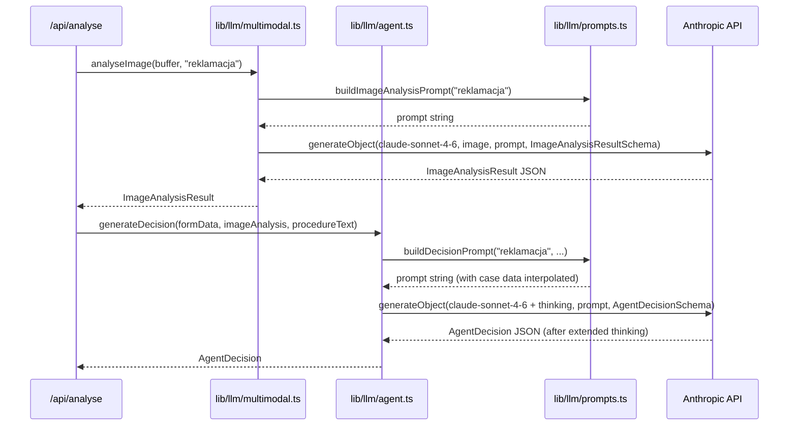
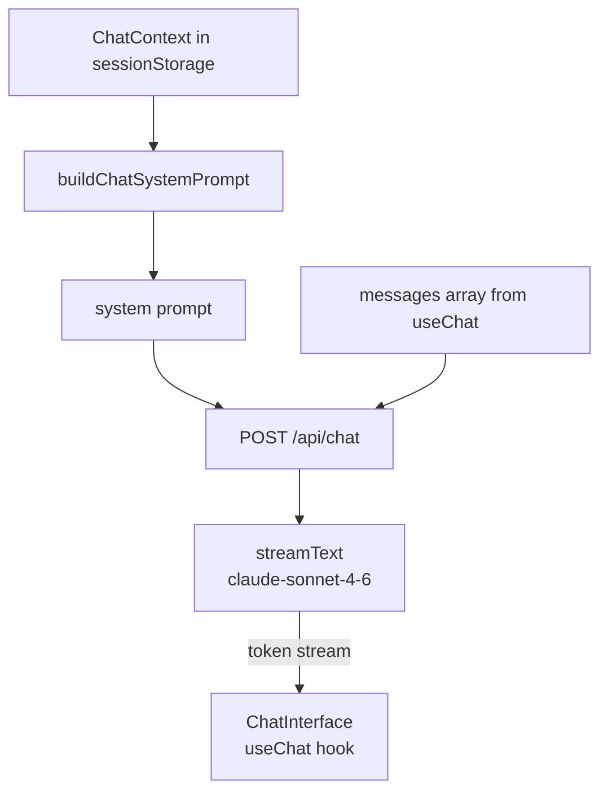

# ADR-003: AI Agents & LLM Integration

**Date:** 2026-06-24
**Status:** Accepted
**Relates to:** `docs/ADR/000-main-architecture.md`

---

## 1. Scope

This ADR covers all AI/LLM integration details:

- Multimodal LLM call for image analysis (`lib/llm/multimodal.ts`)
- Thinking agent for decision generation (`lib/llm/agent.ts`)
- Chat agent for conversation (`app/api/chat/route.ts` — AI behaviour only)
- All prompt templates (`lib/llm/prompts.ts`)
- Model configuration, output parsing, and structured output schemas

This ADR does NOT cover: API route HTTP handling (ADR-001), UI rendering of decisions (ADR-002).

---

## 2. Context7 References

| Library | Context7 Handle | Used for |
|---|---|---|
| Vercel AI SDK | `/vercel/ai` | `generateText`, `streamText`, `generateObject` |
| Zod | `/colinhacks/zod` | Structured output schemas parsed from LLM responses |

---

## 3. Component Design

### `lib/llm/multimodal.ts`

Exports: `analyseImage(imageBuffer: Buffer, requestType: "reklamacja" | "zwrot"): Promise<ImageAnalysisResult>`

Behaviour:
- Selects the appropriate prompt based on `requestType` from `lib/llm/prompts.ts`.
- Calls Vercel AI SDK `generateObject` with Claude claude-sonnet-4-6, the image (base64-encoded), and `ImageAnalysisResultSchema` (Zod) as the output schema.
- `generateObject` enforces structured JSON output — no manual parsing needed.
- Returns the validated `ImageAnalysisResult`.
- Throws `LLMError` (wrapping the SDK error) on API failure.

Why `generateObject` over `generateText` + manual parse: Vercel AI SDK's `generateObject` uses the model's tool-call or JSON mode to enforce schema compliance. Eliminates fragile JSON.parse + manual validation.

### `lib/llm/agent.ts`

Exports: `generateDecision(formData: FormSubmission, imageAnalysis: ImageAnalysisResult, procedureText: string): Promise<AgentDecision>`

Behaviour:
- Selects the appropriate prompt template based on `formData.requestType`.
- Builds the full prompt by interpolating form data, image analysis summary, and procedure text.
- Calls `generateObject` with Claude claude-sonnet-4-6, extended thinking enabled, and `AgentDecisionSchema` (Zod) as the output schema.
- Extended thinking budget: 8000 tokens (sufficient for evaluating procedure rules; adjustable).
- Returns the validated `AgentDecision`.
- Throws `LLMError` on API failure.

### `lib/llm/prompts.ts`

Pure module exporting prompt template functions. No LLM calls — only string construction.

Exports:
- `buildImageAnalysisPrompt(requestType: "reklamacja" | "zwrot"): string`
- `buildDecisionPrompt(requestType: "reklamacja" | "zwrot", formData: FormSubmission, imageAnalysis: ImageAnalysisResult, procedureText: string): string`
- `buildChatSystemPrompt(context: ChatContext): string`

All prompts are in English internally (model instruction language). Agent responses are instructed to be in Polish.

---

## 4. Data Structures

### ImageAnalysisResultSchema (Zod, used with `generateObject`)

```
{
  status: z.enum(["ok", "unreadable"]),
  conditionSummary: z.string(),
  damagePresent: z.boolean(),
  damageType: z.string().nullable(),
  likelyCause: z.enum(["manufacturing_defect","user_damage","wear_and_tear","unknown"]).nullable(),
  signsOfUse: z.boolean().nullable(),
  resalable: z.boolean().nullable(),
  unreadableReason: z.string().nullable()
}
```

For complaint analysis: `likelyCause` is populated, `signsOfUse`/`resalable` are null.
For return analysis: `signsOfUse` and `resalable` are populated, `likelyCause` is null.

### AgentDecisionSchema (Zod, used with `generateObject`)

```
{
  decision: z.enum(["zaakceptowano", "odrzucono", "wymaga_weryfikacji"]),
  justification: z.string().min(50),
  rulesApplied: z.array(z.string()).min(1),
  nextSteps: z.array(z.string()).min(1).max(5),
  disclaimer: z.string()
}
```

`justification` minimum 50 characters enforces a non-trivial explanation.
`rulesApplied` minimum 1 element enforces citation of at least one rule.

---

## 5. Prompt Templates

### Image Analysis Prompt — Complaint (`buildImageAnalysisPrompt("reklamacja")`)

```
You are a hardware service expert analysing a photograph of electronic equipment submitted as part of a warranty complaint.

Analyse the image and return a structured JSON assessment covering:
1. Whether damage is visible and its type/location.
2. The most likely cause of any damage: manufacturing_defect, user_damage, wear_and_tear, or unknown.
3. Overall condition summary in 2-3 sentences.

If the image does not clearly show the equipment, is too dark, blurry, or is unrelated to electronic equipment, set status to "unreadable" and explain why in unreadableReason.

Respond only with the JSON object matching the provided schema. Do not include any other text.
```

### Image Analysis Prompt — Return (`buildImageAnalysisPrompt("zwrot")`)

```
You are a hardware service expert analysing a photograph of electronic equipment submitted as part of a return request.

Analyse the image and return a structured JSON assessment covering:
1. Whether the item shows visible signs of use (scratches, fingerprints on surfaces, worn areas, missing stickers).
2. Whether the item appears to be in resalable condition (like-new or as-new).
3. Whether any damage is present.
4. Overall condition summary in 2-3 sentences.

If the image does not clearly show the equipment, is too dark, blurry, or is unrelated to electronic equipment, set status to "unreadable" and explain why in unreadableReason.

Respond only with the JSON object matching the provided schema. Do not include any other text.
```

### Decision Agent Prompt — Complaint (`buildDecisionPrompt("reklamacja", ...)`)

Template (variables in `{}`):

```
You are a hardware service decision assistant. Your task is to evaluate a warranty complaint case and produce a decision strictly based on the company's complaint procedure rules provided below.

## Case Information

- Equipment type: {equipmentCategory}
- Equipment model: {equipmentModel}
- Purchase date: {purchaseDate}
- Days since purchase: {daysSincePurchase}
- Fault description: {complaintReason}

## Image Analysis Result

{imageAnalysis.conditionSummary}
- Damage present: {imageAnalysis.damagePresent}
- Damage type: {imageAnalysis.damageType}
- Likely cause: {imageAnalysis.likelyCause}

## Company Complaint Procedure

{procedureText}

## Instructions

1. Evaluate this case against each relevant rule in the procedure above.
2. Cite the specific rule IDs (e.g. RULE-C-05) that apply to this case.
3. Produce one of three decisions: "zaakceptowano", "odrzucono", or "wymaga_weryfikacji".
4. Write the justification in Polish. Be specific: reference the rule, the evidence, and why it leads to the decision.
5. List 1-5 concrete next steps for the employee in Polish.
6. Always include this disclaimer in Polish: "Decyzja została wygenerowana automatycznie przez system AI. Pracownik jest odpowiedzialny za ostateczną weryfikację przed przekazaniem informacji klientowi."

Do not invent rules not present in the procedure. If the case cannot be determined by the provided rules, use "wymaga_weryfikacji".

Respond only with the JSON object matching the provided schema.
```

### Decision Agent Prompt — Return (`buildDecisionPrompt("zwrot", ...)`)

Same structure as complaint prompt, substituting:
- Section header: "Company Return Procedure"
- `procedureText`: return-procedure.md content
- Image analysis fields: `signsOfUse`, `resalable` instead of `likelyCause`
- Rule IDs cited use RULE-R-XX prefix

### Chat System Prompt (`buildChatSystemPrompt(context)`)

```
You are a hardware service decision assistant helping an employee process a {requestType} request.

## Current Case

- Request type: {requestType}
- Equipment: {equipmentCategory} — {equipmentModel}
- Purchase date: {purchaseDate}
- {complaintReasonSection}

## Equipment Condition (from image analysis)

{imageConditionSummary}

## Decision Already Issued

Decision: {decisionResult}
Justification: {decisionJustification}
Rules applied: {rulesApplied.join(", ")}

## Your Role in This Conversation

- Answer the employee's follow-up questions about this case in Polish.
- If the employee provides new information that changes the case assessment, acknowledge it and explain how it affects the decision.
- If there is a contradiction between new information and the image analysis, explicitly name the contradiction and explain your reasoning.
- Stay focused on this case. If the employee asks about unrelated topics, politely decline and redirect: "To zgłoszenie dotyczy {requestType} sprzętu {equipmentModel}. Czy mogę pomóc w kwestiach związanych z tą sprawą?"
- Never invent rules or policies not grounded in the original procedure.
- Always respond in Polish.
```

---

## 6. Technical Decisions

### `generateObject` for structured LLM output (not `generateText` + manual parse)
**Status:** Accepted
**Date:** 2026-06-24
**Context:** Both LLM calls must return structured JSON (`ImageAnalysisResult`, `AgentDecision`). Manual parsing of `generateText` output is fragile — the model may wrap JSON in markdown code blocks or add explanatory text.
**Decision:** Use Vercel AI SDK `generateObject` with Zod schemas. The SDK handles JSON mode / tool-call enforcement and validates the output against the schema before returning.
**Rejected alternatives:**
- `generateText` + `JSON.parse`: Requires stripping markdown, handling partial JSON, retrying on parse failure.
- `generateText` + `z.parse` with retry loop: Adds complexity for a problem `generateObject` solves natively.
**Consequences:**
- (+) Type-safe structured output; no parsing boilerplate; automatic retry on schema mismatch.
- (-) `generateObject` does not support streaming — the full response must complete before returning. Acceptable for both LLM calls in `/api/analyse` (no streaming needed there).
**Review trigger:** Never for this flow — streaming is only needed in `/api/chat`, which correctly uses `streamText`.

### Extended thinking enabled for decision agent with 8000-token budget
**Status:** Accepted
**Date:** 2026-06-24
**Context:** The decision agent must reason over the procedure document, case facts, and image analysis to produce a reliable, rule-grounded decision. Extended thinking allows the model to reason before producing output, reducing hallucination risk.
**Decision:** Enable extended thinking on the `generateObject` call in `lib/llm/agent.ts`. Budget: 8000 tokens. This is sufficient to reason over the two procedure documents (approx. 1500 tokens each) and the case data.
**Rejected alternatives:**
- Standard generation without thinking: Higher risk of unsupported reasoning steps or fabricated rule citations.
- Higher thinking budget (16k+): Not necessary for the procedure document size; increases latency and cost.
**Consequences:**
- (+) More reliable rule citation; better decision quality on edge cases.
- (-) Adds 5–15 seconds latency to the `/api/analyse` call; mitigated by loading screen status messages per PRD Screen 2.
**Review trigger:** If average `/api/analyse` latency exceeds 60 seconds (reduce budget or switch to a faster model).

### Prompts in English, responses in Polish
**Status:** Accepted
**Date:** 2026-06-24
**Context:** The procedure documents are written in English (as authored in this repo). The UI and all user-facing text must be in Polish per the PRD. LLM instruction quality is highest in English for these models.
**Decision:** Write all system and user prompt instructions in English. Explicitly instruct the model to respond in Polish in every prompt template. The `justification`, `nextSteps`, and `disclaimer` fields in `AgentDecision` are always in Polish.
**Rejected alternatives:**
- All-Polish prompts: Instruction-following quality is lower for complex reasoning in Polish with current models.
- Auto-translate UI: Adds a translation layer with its own failure modes.
**Consequences:**
- (+) Best instruction-following quality; clean separation of concerns.
- (-) Procedure documents must remain in English (or bilingual) for the prompts to reference them accurately — document authors must be aware.
**Review trigger:** If the model is switched to one with native Polish reasoning capability.

---

## 7. Diagrams

### LLM Call Sequence — `/api/analyse`



### Chat Agent Context Flow



---

## 8. Testing Strategy

### Test scenarios for this area

| Scenario | Type | Input | Expected output | Edge cases |
|---|---|---|---|---|
| `buildImageAnalysisPrompt("reklamacja")` returns non-empty string | Unit | — | String containing "damage" and "manufacturing_defect" | — |
| `buildImageAnalysisPrompt("zwrot")` returns non-empty string | Unit | — | String containing "signs of use" and "resalable" | — |
| `buildDecisionPrompt` interpolates all fields | Unit | Full `FormSubmission` + `ImageAnalysisResult` | Output string contains equipment model, purchase date, image summary | Missing optional fields handled gracefully |
| `buildChatSystemPrompt` contains decision result | Unit | `ChatContext` with `decisionResult: "zaakceptowano"` | Output string contains "zaakceptowano" | — |
| `analyseImage` — mocked complaint happy path | Integration | Mock `generateObject` returning valid `ImageAnalysisResult` with `status: "ok"` | Returns typed `ImageAnalysisResult` | — |
| `analyseImage` — mocked unreadable image | Integration | Mock returning `status: "unreadable"` | Returns `ImageAnalysisResult` with `status: "unreadable"` | — |
| `analyseImage` — API error | Integration | Mock throwing `APIError` | Throws `LLMError` | — |
| `generateDecision` — complaint accepted | Integration | Mock returning valid `AgentDecision` with `decision: "zaakceptowano"`, `rulesApplied: ["RULE-C-13"]` | Returns typed `AgentDecision` with correct fields | — |
| `generateDecision` — schema violation (empty rulesApplied) | Integration | Mock returning `{ ...validDecision, rulesApplied: [] }` | Zod validation fails; `generateObject` retries or throws | — |
| `buildDecisionPrompt` includes procedure text | Unit | Procedure text = "RULE-C-01 ..." | Output string contains "RULE-C-01" | Procedure text is not truncated |

### Technical acceptance criteria

- **TAC-003-01**: `analyseImage` always returns an `ImageAnalysisResult` that passes `ImageAnalysisResultSchema.parse()` without throwing.
- **TAC-003-02**: `generateDecision` always returns an `AgentDecision` that passes `AgentDecisionSchema.parse()` without throwing.
- **TAC-003-03**: `AgentDecision.rulesApplied` always contains at least one non-empty string (enforced by Zod schema `min(1)`).
- **TAC-003-04**: `AgentDecision.justification` is always at least 50 characters (enforced by Zod schema `min(50)`).
- **TAC-003-05**: `buildChatSystemPrompt` output always contains the phrase "Nie odpowiadaj na pytania niezwiązane" or equivalent redirection instruction (verified by unit test asserting string inclusion).
- **TAC-003-06**: All three prompt-building functions return strings in under 1ms (they are pure synchronous functions — no I/O).
- **TAC-003-07**: Mock-based integration tests for `analyseImage` and `generateDecision` run without making real Anthropic API calls.
