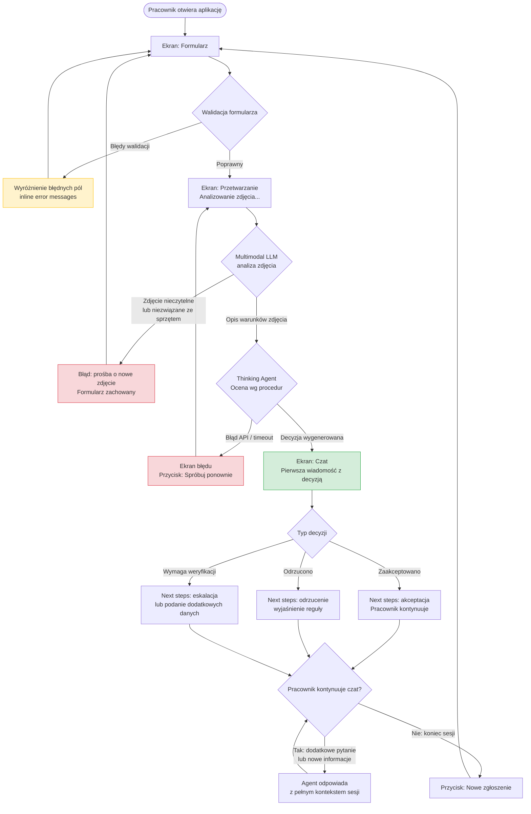

# PRD — Hardware Service Decision Copilot

---

## 1. Executive Summary

Hardware Service Decision Copilot is an MVP internal web application that supports customer support and hardware service employees in making consistent, rule-based decisions on electronics complaint and return requests. The system guides the employee through a structured form, uses a multimodal LLM to assess the equipment's physical condition from an uploaded image, and then presents a decision with justification via a conversational chat interface. This is a PoC/MVP; optional features (customer history, session persistence, RAG knowledge base) are explicitly deferred.

---

## 2. Problem Statement

Customer support and service employees currently handle complaint and return decisions inconsistently. Each agent applies personal judgment when interpreting company procedures, which leads to contradictory outcomes for similar cases, customer dissatisfaction, and compliance risk. Employees must manually cross-reference multiple procedure documents while simultaneously managing the customer interaction. There is no structured decision trail and no tool that enforces the company's own rules at the point of decision.

---

## 3. Users / Personas

### Persona A — Customer Support Agent (Pracownik Obsługi Klienta)
Handles inbound complaint and return requests remotely (phone, email, in-person counter). Not technically specialised. Needs a fast, guided workflow to collect the required information and receive a clear, defensible decision without having to interpret policy documents themselves.

### Persona B — Service Technician (Technik Serwisu)
Physically receives equipment at the service point, assesses condition, and decides whether to accept a complaint or return. Has technical knowledge but needs procedural guidance to stay compliant with company rules, especially for edge cases.

### Persona C — Service Supervisor (Supervisor Serwisu) *(read-only reference persona — not an active system user in MVP)*
May review completed decisions after the fact. Not an active system user in MVP; included to clarify what information must be present in the decision output to support later review.

---

## 4. Main Flows

### 4.1 Happy Path — Complaint Accepted

1. Employee opens the application in a web browser.
2. The form screen is displayed with an empty form.
3. Employee selects **"Reklamacja"** (Complaint) from the request type dropdown.
4. Employee selects the equipment category from the predefined list.
5. Employee enters the equipment name/model in the text field.
6. Employee selects the purchase date using the date picker.
7. Employee enters a description of the fault in the complaint reason textarea (obligatory for complaints).
8. Employee uploads one image of the equipment.
9. Employee clicks **"Wyślij"** (Submit).
10. The system validates all fields; if valid, displays a processing/loading screen.
11. Backend receives form data and image; compresses image before forwarding.
12. Backend sends compressed image to the multimodal LLM with the complaint-specific analysis prompt.
13. Multimodal LLM returns a structured description of the equipment's visible condition and damage type.
14. Backend sends the image description, form data, and complaint procedure document to the thinking LLM agent.
15. Agent evaluates all inputs against the complaint procedure rules and produces a decision.
16. Chat interface opens. The first message from the agent is displayed, containing: greeting, decision result (**Zaakceptowano**), justification referencing specific procedure rules, and next steps for the employee.
17. Employee may ask follow-up questions or provide additional context in the chat input.
18. Agent responds with full conversational context (form data + image description + prior messages) maintained throughout the session.

### 4.2 Happy Path — Return Accepted

Steps 1–9 identical to 4.1, with the following differences:
- Employee selects **"Zwrot"** (Return) at step 3.
- Complaint reason textarea is optional for returns.
- At step 12, backend uses the return-specific image analysis prompt (assessing whether the item shows signs of use and is resalable).
- At step 14, backend uses the return procedure document and return-specific agent prompt.
- Decision in step 16 is **Zaakceptowano** with justification that item shows no signs of use and meets return criteria.

### 4.3 Alternative Path — Request Rejected

Identical to 4.1 or 4.2 until step 15. Agent produces a **Odrzucono** decision. First chat message includes: rejection decision, specific rule(s) that the case fails to meet, explanation of which condition was not fulfilled (e.g. purchase date exceeds return window, damage is user-caused), and what options remain available to the customer.

### 4.4 Alternative Path — Requires Additional Information

Agent produces a **Wymaga weryfikacji** result when the image is ambiguous or the form data is insufficient to make a definitive determination. First chat message explains what specific information or additional evidence is needed. Employee uses the chat to provide clarification or upload description of additional observations.

### 4.5 Alternative Path — Image Unreadable or Irrelevant

After step 11, multimodal LLM returns a result indicating the image does not show the equipment clearly or is unrelated to the equipment. System displays an error within the loading screen (does not open chat) and prompts the employee to re-upload a suitable image. The form data is retained. The employee re-uploads and resubmits.

### 4.6 Alternative Path — Form Validation Failure

At step 10, one or more required fields are missing or invalid (e.g. future purchase date, no image, missing complaint reason for a complaint). System highlights the failing fields inline with error messages. Employee corrects and resubmits. No backend call is made until all validations pass.

---

## 5. User Stories

**US-01** — As a Customer Support Agent, I want to submit a structured form with equipment details and a photo so that I have a consistent, documented starting point for every case.

**US-02** — As a Service Technician, I want to receive an AI-generated decision with a clear justification immediately after submitting the form so that I can process the case quickly without reading the full procedure document.

**US-03** — As a Customer Support Agent, I want to continue the conversation with the agent after the initial decision so that I can provide additional context and receive an updated assessment without starting over.

**US-04** — As a Service Technician, I want the agent to explicitly cite which rule or procedure clause its decision is based on so that I can explain the decision to the customer confidently.

**US-05** — As a Customer Support Agent, I want the system to tell me clearly what to do next after each decision (accepted / rejected / escalate) so that I do not have to consult a separate procedure.

**US-06** — As a Customer Support Agent, I want the system to warn me if the uploaded image does not clearly show the equipment so that I can request a better photo before proceeding.

**US-07** — As a Service Technician, I want the form to prevent me from submitting a purchase date in the future so that I avoid data entry errors.

**US-08** — As a Customer Support Agent, I want the agent to stay on topic and redirect me if I ask it questions unrelated to the complaint or return case so that the session remains focused.

---

## 6. Acceptance Criteria

### Form

**AC-01** — The request type field displays exactly two options: "Reklamacja" and "Zwrot".

**AC-02** — The equipment category field is a predefined dropdown. Submission fails if no category is selected.

**AC-03** — The equipment name/model field accepts free text up to 200 characters. Submission fails if empty.

**AC-04** — The purchase date field is a date picker. Submission fails if the date is in the future or if no date is selected.

**AC-05** — The complaint reason textarea is mandatory when request type is "Reklamacja". Submission fails if empty in that case. It is optional when request type is "Zwrot". Maximum 2000 characters.

**AC-06** — The image upload field accepts JPG, PNG, and WebP formats only. Submission fails if no image is uploaded, if the file format is not accepted, or if the file size exceeds 10 MB before compression.

**AC-07** — On submission failure, each failing field is highlighted with a specific inline error message. The form retains all previously entered values.

**AC-08** — The submit button is disabled and shows a loading indicator while a submission is being processed. It cannot be clicked twice.

### Image Processing

**AC-09** — Backend compresses the uploaded image to a maximum of 1 MB before forwarding it to the multimodal LLM. The original file is not stored in MVP.

**AC-10** — If the multimodal LLM returns a result indicating the image is unreadable or does not show the equipment, the system returns the user to the form with an error message specifying the problem. The form data is retained.

### AI Analysis — Complaint Scenario

**AC-11** — The multimodal LLM prompt for complaints instructs the model to assess: whether damage is visible, the type and extent of damage, and the likely cause (user-caused vs. manufacturing defect vs. normal wear).

**AC-12** — The thinking agent for complaints evaluates the image description and form data against the complaint procedure rules and returns one of three decisions: "Zaakceptowano", "Odrzucono", or "Wymaga weryfikacji".

**AC-13** — Every agent decision includes a reference to the specific rule(s) from the complaint procedure document that the decision is based on.

### AI Analysis — Return Scenario

**AC-14** — The multimodal LLM prompt for returns instructs the model to assess: whether the item shows visible signs of use, whether it appears to be in resalable condition, and whether any damage is present.

**AC-15** — The thinking agent for returns evaluates the image description and form data against the return procedure rules and returns one of three decisions: "Zaakceptowano", "Odrzucono", or "Wymaga weryfikacji".

**AC-16** — Every agent decision for returns includes a reference to the specific rule(s) from the return procedure document that the decision is based on.

### Chat Interface

**AC-17** — The chat interface opens only after a successful agent decision is produced. It never opens if image processing or agent evaluation fails.

**AC-18** — The first message in the chat is from the system/agent and contains: a greeting, the decision result (Zaakceptowano / Odrzucono / Wymaga weryfikacji), a justification with rule references, and clearly stated next steps.

**AC-19** — The first message is formatted with distinct visual sections for: decision result, justification, and next steps. Plain prose for the remaining chat messages.

**AC-20** — The agent retains the full session context throughout the conversation: form data, image description, and all prior messages. Responses are consistent with this context.

**AC-21** — When the user asks a question unrelated to the current complaint or return case, the agent responds politely, declines to answer the off-topic question, and redirects the conversation to the case at hand.

**AC-22** — When the user provides additional information in chat that contradicts the image analysis result, the agent explicitly acknowledges the contradiction and states which source (image vs. user input) it is weighting and why.

**AC-23** — The chat input field is disabled while the agent is generating a response. A loading indicator is shown.

### General

**AC-24** — All user-facing text in the interface is in Polish.

**AC-25** — The application loads and the form is interactive within 3 seconds on a standard office network connection.

**AC-26** — If the AI backend (multimodal LLM or thinking agent) returns an error or times out, the system displays a user-facing error message in Polish and offers the option to retry the submission.

---

## 7. Out of Scope

**Authentication and authorisation** — No login, no user accounts, no role-based access control in MVP. The application is assumed to be deployed on an internal network accessible only to employees.

**Customer identity and purchase history** — No retrieval of customer data. No integration with any CRM, ERP, or SQLite customer database. The employee enters all case data manually.

**Session persistence and audit log** — No saving of sessions, decisions, or conversation history to a database. Each browser session is independent and ephemeral.

**Multiple image upload** — Only one image per case is supported. Additional images during chat are not supported.

**RAG knowledge base** — No vector database or retrieval-augmented generation over an electronics knowledge base.

**Supervisor / admin panel** — No UI for reviewing past decisions, overriding decisions, or managing procedure documents.

**Email or notification dispatch** — No automated emails, SMS, or push notifications.

**Mobile application** — Web browser only. No native iOS or Android app.

**Multi-language support** — Polish only. No language selector.

**Reporting and analytics** — No dashboards, statistics, or export functions.

**Customer-facing interface** — The system is for internal employee use only. Customers do not interact with it directly.

---

## 8. Constraints

### Business

- Decisions produced by the agent are recommendations to the employee, not final automated decisions. The employee retains responsibility for the outcome.
- The agent must base every decision on the company procedure documents provided. It must not invent rules or reference policies not in the injected documents.
- The agent must include a disclaimer in each decision message that the recommendation is AI-generated and should be reviewed by the employee before communicating to the customer.

### Functional

- Request type: exactly 2 options — "Reklamacja", "Zwrot".
- Equipment categories (predefined list): Laptopy i komputery, Smartfony i telefony, Tablety, Konsole do gier, Sprzęt audio (słuchawki, głośniki), Telewizory i monitory, Małe AGD, Akcesoria (ładowarki, kable, inne).
- Image upload: JPG, PNG, WebP only. Max 10 MB before compression. One image per submission.
- Backend compresses image to ≤ 1 MB before sending to multimodal LLM.
- Complaint reason: max 2000 characters. Required for "Reklamacja", optional for "Zwrot".
- Equipment name/model: max 200 characters, free text.
- Purchase date: must not be in the future. No constraint on how far in the past.
- Agent decision values: exactly three — "Zaakceptowano", "Odrzucono", "Wymaga weryfikacji".
- All user-facing text in Polish. Procedure documents and internal prompts may be in Polish or English (decided in ADR).

### External Document / Data References

| Document | File Path | When Used |
|---|---|---|
| Complaint Procedure | `docs/procedures/complaint-procedure.md` | Injected into the thinking agent prompt for "Reklamacja" cases |
| Return Procedure | `docs/procedures/return-procedure.md` | Injected into the thinking agent prompt for "Zwrot" cases |

---

## 9. UI Description (Wireframe Level)

### Screen 1 — Form

**Layout**: Single-column form, centred, max-width ~640px. Application title and logo at the top. Form fields stacked vertically with visible labels above each field. Single primary action button at the bottom.

**Fields (top to bottom)**:
- **Typ zgłoszenia** — dropdown, required. Options: "Reklamacja", "Zwrot". Default: placeholder "Wybierz typ zgłoszenia".
- **Kategoria sprzętu** — dropdown, required. Options: predefined list (see Section 8). Default: placeholder "Wybierz kategorię".
- **Nazwa / Model sprzętu** — single-line text input, required. Placeholder: "np. Samsung Galaxy S23".
- **Data zakupu** — date picker, required. No future dates selectable.
- **Opis reklamacji / powód zwrotu** — textarea, required for "Reklamacja", labelled "Opis usterki lub powodu reklamacji" / "Powód zwrotu (opcjonalnie)". Label and required state change dynamically based on the request type selection. Max 2000 characters with a visible character counter.
- **Zdjęcie sprzętu** — file upload component. Accepts JPG, PNG, WebP. Displays file name and thumbnail preview after selection. Shows accepted formats and max size hint. Required.

**Error states**: Each field shows a red border and an inline error message directly below it when validation fails on submit attempt.

**Submit button**: "Wyślij zgłoszenie" — full width, primary colour. Disabled and shows spinner while submitting.

**Empty state**: All fields empty on first load.

### Screen 2 — Processing

**Layout**: Centred, full-screen overlay or replacement of the form. Displays a loading spinner with a short status message.

**Status messages** (sequential, displayed as processing progresses):
1. "Analizowanie zdjęcia…"
2. "Generowanie decyzji…"

**Error state**: If processing fails (LLM error, timeout), the spinner is replaced by an error message in Polish with a "Spróbuj ponownie" (Retry) button that returns the user to the pre-filled form. If the image was deemed unreadable, the message specifies this and the form is shown with the image field highlighted.

### Screen 3 — Chat Interface

**Layout**: Full-height chat window. Message list occupies the main area with auto-scroll to newest message. Fixed input bar at the bottom.

**First message (system)**: Displayed as a chat bubble aligned to the left, visually distinct from subsequent messages (e.g. slightly different background). Content structure:
- Line 1: Greeting ("Dzień dobry, oto wynik analizy zgłoszenia.")
- Block: **Decyzja**: [Zaakceptowano / Odrzucono / Wymaga weryfikacji] — visually highlighted (badge or bold label).
- Block: **Uzasadnienie**: narrative explanation referencing specific procedure rules.
- Block: **Kolejne kroki**: numbered list of what the employee should do next.
- Block: Disclaimer (small text): "Decyzja została wygenerowana automatycznie przez system AI. Pracownik jest odpowiedzialny za ostateczną weryfikację przed przekazaniem informacji klientowi."

**Subsequent messages**: Standard chat bubbles. Employee messages aligned right, agent messages aligned left.

**Loading state**: While agent is responding, a typing indicator (three dots animation) appears in the agent bubble position.

**Input bar**: Textarea (single-line, expands to multi-line), send button. Disabled while agent is responding.

**No navigation back to form** from the chat screen. The session is complete once the chat opens. A "Nowe zgłoszenie" (New case) button is visible in the header to start a fresh form session.

---

## 10. User Flow Diagram

---

## 11. Agent / System Behavior Specification

### 11.1 Multimodal LLM — Image Analysis Agent

**Role**: Analyses the uploaded image and returns a structured description of the equipment's visible physical condition. Does not make a complaint/return decision.

**Complaint prompt objective**: Determine (a) whether damage is visible, (b) the type and location of damage (e.g. cracked screen, dented casing, liquid damage indicators), (c) likely cause of damage (user-caused, manufacturing defect, normal wear and tear), (d) severity assessment.

**Return prompt objective**: Determine (a) whether the item shows visible signs of use (scratches, worn surfaces, missing components, markings), (b) whether the item appears to be in a condition suitable for resale as new or like-new, (c) presence of any damage.

**Not allowed to**:
- Make the final complaint/return decision.
- Reference company procedures.
- Output anything other than a structured condition description.

**On unreadable image**: Returns a structured response with status `UNREADABLE` and a reason (e.g. "image too dark", "equipment not visible", "image does not show the claimed device"). The backend interprets this status and does not forward to the thinking agent.

### 11.2 Thinking LLM — Decision Agent

**Role**: Acts as a decision-support assistant. Evaluates the case against the relevant company procedure document and produces a decision with justification.

**Inputs available in context**:
- Request type (Reklamacja / Zwrot)
- Equipment category and model
- Purchase date
- Complaint reason / return reason (if provided)
- Structured image description from multimodal LLM
- Full text of the relevant procedure document (complaint or return)
- Full conversation history after the first decision message

**Decision values**: Exactly three — "Zaakceptowano", "Odrzucono", "Wymaga weryfikacji".

**Allowed to**:
- Reference and quote specific rules from the injected procedure document.
- Ask the employee for additional information via the chat.
- Adjust its assessment if the employee provides new information in the chat.
- Flag contradictions between the image analysis and the employee's description.

**Not allowed to**:
- Invent rules, policies, or warranty terms not present in the injected procedure document.
- Provide legal advice.
- Contact external systems.
- Discuss topics unrelated to the current complaint or return case (e.g. general product questions, pricing, other customers).
- Produce a final decision without citing the specific procedure rule(s) it is applying.

**Contradiction handling**: If the image analysis suggests user-caused damage but the employee states otherwise, the agent explicitly names the contradiction in its response, explains which evidence it is weighting more heavily and why, and may issue a "Wymaga weryfikacji" decision pending supervisor review.

**Off-topic handling**: Agent responds briefly in Polish, declines to engage with the off-topic question, and redirects: "To zgłoszenie dotyczy [typ zgłoszenia] sprzętu [model]. Czy mogę pomóc w kwestiach związanych z tą sprawą?"

**Mandatory disclaimer**: Every first decision message must include the AI-generated disclaimer as specified in Section 9, Screen 3.

**Language**: All agent responses in Polish.

---

## 12. Further Notes

**Assumptions made (to be confirmed)**:
- No authentication is required for MVP; the app is deployed on a secured internal network.
- "Wymaga weryfikacji" cases are handled by the employee escalating to a supervisor outside the system (no in-app escalation flow in MVP).
- The procedure documents (`complaint-procedure.md`, `return-procedure.md`) are static files loaded at application startup. No UI for updating them in MVP.
- The application is a single-page web app; no multi-tab or multi-session management is needed.
- Return window and complaint eligibility rules are defined in the procedure documents. Example versions are provided in `docs/procedures/`.
- Image compression algorithm and target format are decided in the ADR, not the PRD.
- The thinking LLM model choice (which model supports "thinking" / extended reasoning) is decided in the ADR.

**Open questions deferred to ADR**:
- Which multimodal LLM and which thinking LLM to use.
- Frontend framework and component library.
- Backend language and framework.
- Image compression library and target size/quality parameters.
- Session state management (in-memory on backend vs. frontend).
- Deployment environment and infrastructure.
